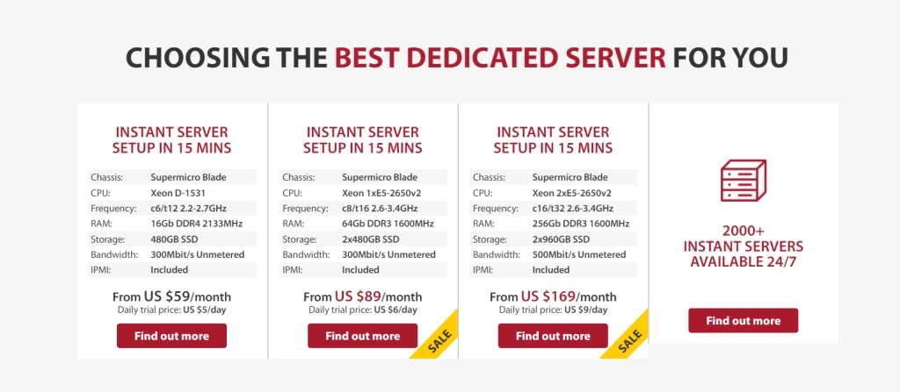

# GTHost Review: Global Server Coverage for Your Growing Business

Looking to reach customers worldwide without sacrificing speed? Running a business where most clients sit thousands of miles from your servers? If you're serious about global expansion while maintaining lightning-fast performance, you need hosting that actually delivers on that promise.

GTHost offers dedicated server solutions across 17+ data centers worldwide, giving you the flexibility to choose your storage requirements and server location. Founded in 2012, this hosting platform specializes in helping businesses bridge geographical gaps without compromising performance or breaking the bank.

---

## What Makes GTHost Different

Here's the thing about most hosting providers: they talk a big game about "global reach" but stick you with limited locations and rigid plans. GTHost flips that script. You get to build your hosting plan based on what you actually need—not what some marketing team decided was "standard."

The platform operates 17+ data centers spread across major regions:

## Security That Actually Matters

Your data represents months or years of work. It's the backbone of your online presence and, honestly, losing it would be catastrophic.

GTHost handles security through two main approaches: DDoS protection that keeps attacks at bay, and SSL encryption for your stored data. They also prevent outbound attacks from their servers, which means you're operating in a cleaner neighborhood, so to speak.

Is it Pentagon-level security? No. But for most businesses, it covers the essentials without overcomplicating things.

## Getting Help When You Need It

Switching hosting providers feels like moving apartments—exciting but stressful, especially those first few days.

GTHost runs 24/7 support through phone, live chat, and email. They even separate support emails by category (billing, technical, etc.), which sounds small but actually saves time when you're troubleshooting at 2 AM.

## The Features That Actually Move the Needle

### No Bandwidth Limits

Remember the days of watching your bandwidth usage like a hawk, afraid of overage charges? GTHost doesn't play that game. 👉 [Discover how unlimited bandwidth keeps your growing business running smoothly](https://cp.gthost.com/en/join/72c7e6b2fc118929f9ede2978f008806).

Use what you need. Scale when you're ready. No surprise bills.

### Setup Speed

Most hosting platforms make you wait hours—sometimes a full day—before your server goes live. GTHost provisions servers in 5-15 minutes after purchase. That's faster than most people can finish their coffee.

### Full Root Access

You're paying for the server. You should control it completely. GTHost gives full root access, meaning every configuration, every change, every tweak sits in your hands. No tickets to IT. No waiting for permission.

## Building Your Plan

GTHost primarily offers dedicated server hosting, but here's where it gets interesting: you construct your own plan. Choose your location. Pick your storage. Select your resources.

Pricing starts around $59 monthly, but it scales based on your choices. Think of it less like buying a preset package and more like ordering from a menu where you decide every ingredient.

## Common Questions

**Does GTHost offer a free trial?**

Not exactly. They offer 1-10 day low-cost trial periods (yes, that phrasing is confusing). Check their Terms of Service to understand what "low-cost trial" actually means for your situation.

**What does GTHost cost?**

Starting at $59/month for dedicated servers, but your final price depends entirely on the specifications you choose. More storage, premium locations, and additional resources push that number higher.

**How do I reach support?**

Three ways: live chat, phone calls, or email. Different email addresses handle different issues (billing vs technical), which streamlines the whole support process.

**Do they offer dedicated servers?**

Yes, that's their primary focus. Choose your region, specify storage needs, and you're set. Most offerings are dedicated rather than shared.

## Final Take

GTHost solves a specific problem: you need servers close to your customers, but you don't want cookie-cutter plans that waste resources or leave you short on capacity.

The 17+ data center locations mean you can actually position servers where they matter. Unlimited bandwidth removes artificial growth constraints. DDoS protection and SSL encryption cover security basics. 👉 [See why GTHost's flexible infrastructure makes it perfect for businesses targeting international markets](https://cp.gthost.com/en/join/72c7e6b2fc118929f9ede2978f008806).

The trial period wording could be clearer—that's a legitimate frustration. But if you're running a business that needs global server coverage with the flexibility to build exactly what you need, GTHost delivers on that core promise.
